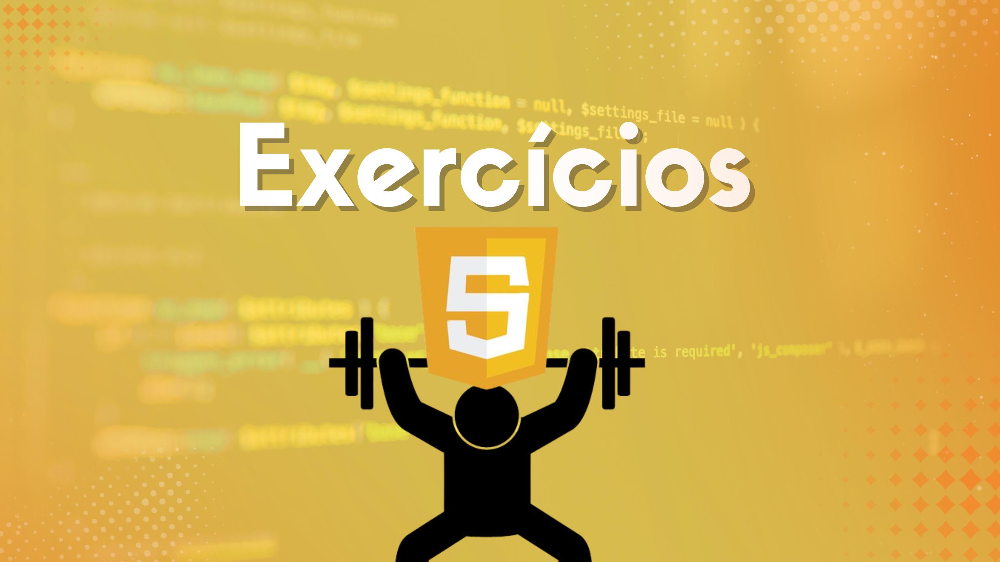

<div align="center">



# ⚡ Exercícios de JavaScript
### Praticando Lógica e Programação com o Curso em Vídeo

<p align="center">
  
  
  
</p>
</div>

---

## 🎯 Visão Geral do Repositório

```diff
! Este repositório foi criado para organizar todos os meus exercícios e desafios práticos realizados durante o curso de JavaScript do Curso em Vídeo.
! Sob a mentoria do mestre Gustavo Guanabara, estou explorando desde os conceitos mais básicos até a manipulação avançada do DOM e lógica de programação.
! O objetivo principal é consolidar o aprendizado através da prática constante, documentando cada passo da minha evolução como desenvolvedor.
! Aqui você encontrará scripts, interfaces interativas e soluções para problemas reais propostos durante as aulas.
```

---

## ⚙️ Estrutura de Aprendizado

```diff
+ Módulo 1 (Básico): Primeiros passos, variáveis, tipos de dados e operadores. Onde a mágica começa com o "Olá, Mundo!".
+ Módulo 2 (DOM): Interatividade com o usuário, manipulação de elementos HTML e estilização dinâmica via CSS.
+ Módulo 3 (Condições): Tomada de decisões no código usando if/else e switch/case para criar programas inteligentes.
+ Módulo 4 (Repetições): Estruturas de loop (while, do while, for) para automação de tarefas repetitivas.
+ Módulo 5 (Variáveis Compostas): Arrays e objetos para organizar dados de forma eficiente.
+ Módulo 6 (Funções): Modularização de código e lógica avançada para projetos mais robustos.
```

---

## 🚀 Tecnologias e Ferramentas Utilizadas

```diff
- JavaScript (ES6+): A linguagem principal, focando em sintaxe moderna e boas práticas de programação.
- HTML5: Estruturação semântica das páginas de exercícios para garantir acessibilidade.
- CSS3: Estilização dos desafios, aplicando layouts responsivos e design visual atraente (foco em Laranja e Amarelo!).
- VS Code: O ambiente de desenvolvimento onde cada linha de código ganha vida.
- Git & GitHub: Controle de versão para manter o histórico de progresso e compartilhamento do conhecimento.
```

---

## 🤯 Desafios e Evolução Técnica

Estudar JavaScript com o **Gustavo Guanabara** tem sido uma experiência transformadora. O maior desafio inicial foi entender como o **DOM (Document Object Model)** funciona e como o JavaScript consegue "dar vida" a uma página estática. Aprender a capturar eventos de clique e manipular formulários abriu um novo mundo de possibilidades.

Além disso, a lógica por trás das **estruturas de repetição** e **funções** exigiu bastante treino e repetição (literalmente!). Ver um algoritmo funcionando perfeitamente após várias tentativas é o que motiva a continuar. Este repositório é o reflexo dessa dedicação, onde cada exercício resolvido representa um degrau subido na jornada de se tornar um programador completo.

---

## 🤝 Autoria e Créditos

<div align="center">

Este repositório é mantido com muito café e dedicação por:

**Érica Bonfanti Corrêa**
[GitHub](https://github.com/EricaBonfanti) | [LinkedIn](https://www.linkedin.com/in/ericabonfanti/)


---

<sub>**"Tudo é possível ao que crê... e ao que pratica muito código!" - Inspirado pelo Curso em Vídeo.**</sub>

</div>
